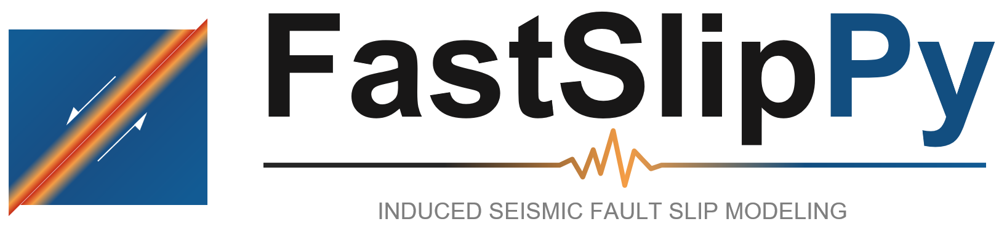

# FastSlipPy: Induced Seismic Fault Slip Modeling

![Release][release-image] 
![License][license-image]
![Contributing][contributing-image]

<!---

-->

[release-image]: https://img.shields.io/badge/release-0.0.1-green.svg?style=flat 

[license-image]: https://img.shields.io/badge/license-MIT-green.svg?style=flat

[contributing-image]: https://img.shields.io/badge/Contributor%20Covenant-2.1-4baaaa.svg

Dynamic fault slip modeling software in induced seismicity. This code aims to ...

The initial version of this software is based on the open-source code [IndNuc][IndNuc_link].

## Table of Contents
- [Main Features](#main-features)
- [Dependencies](#demgen-dependencies)
- [Instructions](#instructions)
    - [Input and Output Files](#input-and-output-files)
    - [Running Simulations](#running-simulations)
    - [Checking Results](#checking-results)
- [Examples](#examples)
- [Documentation](#documentation)
- [How to Contribute](#how-to-contribute)
- [How to Cite](#how-to-cite)
- [Authorship](#authorship)
- [License](#license)

## Main Features

This program can be used for ...

- It provides a ...

## Dependencies

FastSlipPy is fully written in the [Python][python_website] programming language and adopts the Object Oriented Programming (OOP) paradigm to offer modularity and extensibility. Due to the nature of Python, this program can be run on different platforms (Windows or Linux)

Please make sure you have installed Python3.X.X on your PC. Currently, [Python3.10.X][python310_website] is recommended, as other versions haven't been tested.

Required Python Pakage:
- numpy
- matplotlib

## Instructions

### Install

Download this software or use Git:

> git clone https://github.com/ChengshunShang1996/FastSlipPy.git

Then, in the project folder, run cmd command:

> pip install -e .

Test it:

> from fastslippy import FastSlipPy

If you see the logo, you have successfully installed it.

### Input and Output Files

* **Input Parameters (_.json_)**: 

This [JSON][json_link] file is used as input for the program. For generating particle packings, at least one input file is needed: [ParametersDEMGen.json][ParametersDEMGen_link]. 

### Running Simulations

To run a simulation, launch the ...

## Examples

Examples are available inside the folder [examples][examples_link].

## Documentation

Please read this README.md for information.

## How to Contribute

Please check the [contribution guidelines][contribute_link].

## How to Cite

To cite this repository, you can use the metadata from [this file][citation_link].

## Authorship

- **Chengshun Shang** 1 (<c.shang@uu.nl>)

1 Utrecht University ([UU][uu_website])

## Acknowledgement

The program was initially developed under the context of the FastSlip project.

## License

FastSlipPy is licensed under the [MIT license][bsd_license_link],
which allows the program to be freely used by anyone for modification, private use, commercial use, and distribution, only requiring the preservation of copyright and license notices.
No liability and warranty are provided.

[json_link]:            https://www.json.org/
[contribute_link]:      https://github.com/ChengshunShang1996/DEMGen/blob/main/CONTRIBUTING.md
[citation_link]:        https://github.com/ChengshunShang1996/DEMGen/blob/main/CITATION.cff
[uu_website]:           https://www.uu.nl/en
[bsd_license_link]:     https://choosealicense.com/licenses/bsd-2-clause/
[python_website]:       https://www.python.org/
[python310_website]:    https://www.python.org/downloads/release/python-3100/
[examples_link]:        ./example/
[DEMGen_framework_main]: ./src/DEMGen_framework_main.py
[src_folder]:           .src/ 
[IndNuc_link]:          https://github.com/USustSub/IndNuc 